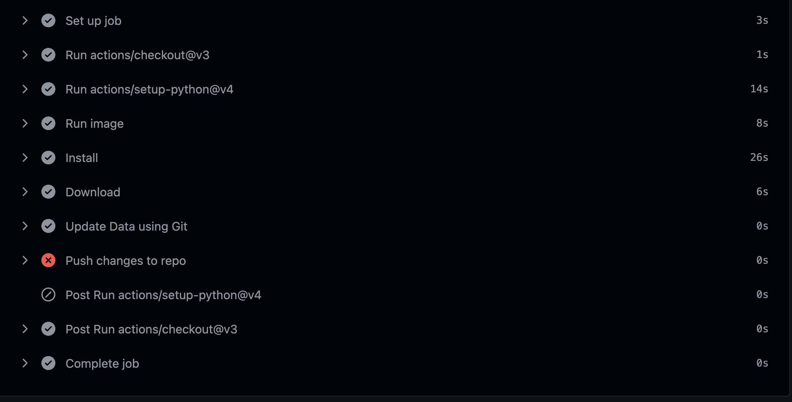

# github-actions-for-data-people

Some demos of GitHub Actions for data scientists.

- [](https://github.com/emptymalei/github-actions-for-data-scientists/actions/workflows/build-resume.yml)
- [](https://github.com/emptymalei/github-actions-for-data-scientists/actions/workflows/personal-docker-image.yml)
- [](https://github.com/emptymalei/github-actions-for-data-scientists/actions/workflows/download-ufo-data.yml)
- [](https://github.com/emptymalei/github-actions-for-data-scientists/actions/workflows/docs-publish.yaml)


## FAQ


### My Actions



```
Push to branch main
remote: Permission to emptymalei/github-actions-for-data-scientists.git denied to github-actions[bot].
fatal: unable to access 'https://github.com/emptymalei/github-actions-for-data-scientists.git/': The requested URL returned error: 403
Error: Invalid exit code: 128
    at ChildProcess.<anonymous> (/home/runner/work/_actions/ad-m/github-push-action/master/start.js:29:21)
    at ChildProcess.emit (node:events:527:28)
    at maybeClose (node:internal/child_process:1092:16)
    at Process.ChildProcess._handle.onexit (node:internal/child_process:302:5) {
  code: 128
}
Error: Invalid exit code: 128
    at ChildProcess.<anonymous> (/home/runner/work/_actions/ad-m/github-push-action/master/start.js:29:21)
    at ChildProcess.emit (node:events:527:28)
    at maybeClose (node:internal/child_process:1092:16)
    at Process.ChildProcess._handle.onexit (node:internal/child_process:302:5)
```

This is because Actions doesn't have enough permission to push back to the repo. Enable it in Settings/Actions/General.


### Failed when logging into Docker


In Settings/Secrets and variables/Actions:


The secrets for DockerHub can be obtained [here](https://hub.docker.com/settings/security).


